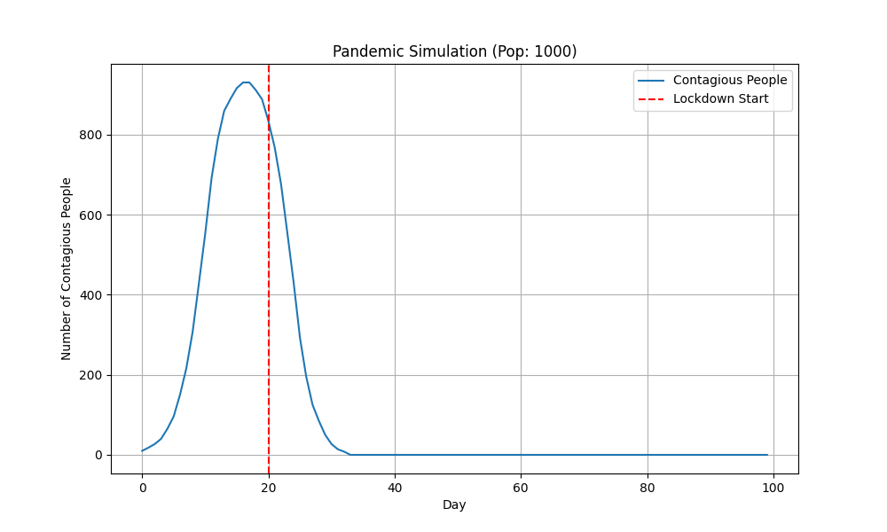

# Simulating a Pandemic

A Python-based simulation of a pandemic spread over 100 days, modeling factors like population immunity, contagious periods, lockdowns, and mask mandates using Gaussian distributions for social interactions.



## Overview

This project simulates the spread of a virus within a population. It models individual agents (People) who interact with a number of friends daily. The simulation tracks the number of contagious individuals over time, allowing for the analysis of interventions like:
- **Lockdowns**: Reducing social interactions.
- **Mask Mandates**: Reducing the contagiousness of interactions.

## Features

- **Object-Oriented Design**: Uses `Person` class to model individual attributes (immunity, contagiousness, mask usage).
- **Gaussian Distribution**: Models the number of friends/interactions using a normal distribution.
- **Intervention Modeling**: Simulates the effect of lockdowns and masks on the curve.
- **Visualization**: Generates a plot of contagious cases over time.

## Installation

1.  Clone the repository.
2.  Install the required dependencies:

```bash
pip install -r requirements.txt
```

## Usage

To run the simulation and generate the plot:

```bash
python visualize.py
```

This will run the simulation with default parameters (Population: 1000, 100 days) and save the output plot to `pandemic_plot.png`.

To use the simulation in your own script:

```python
from simulation import PandemicSimulation

sim = PandemicSimulation(population_size=1000, lockdown_day=20, mask_day=50)
results = sim.run_simulation(days=100)
# results contains the list of daily contagious counts
```

## Project Structure

- `simulation.py`: Core logic for the `Person` class and `PandemicSimulation`.
- `visualize.py`: Script to run the simulation and plot the results.
- `Simulating_Pandemic.ipynb`: Original Jupyter Notebook (legacy).
- `requirements.txt`: Python dependencies.
